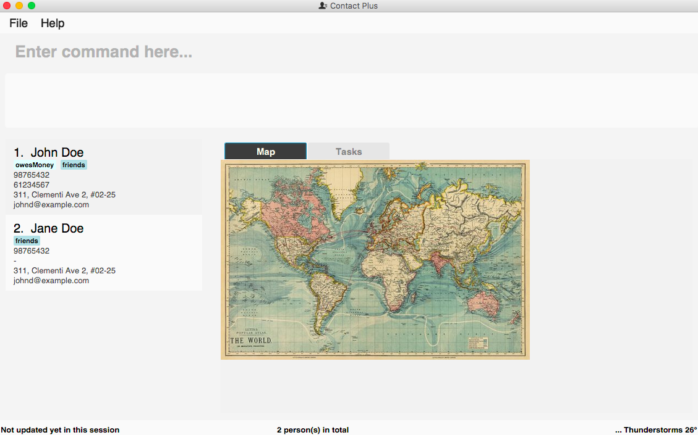

= Contact Plus
ifdef::env-github,env-browser[:relfileprefix: docs/]
ifdef::env-github,env-browser[:outfilesuffix: .adoc]

https://travis-ci.org/CS2103AUG2017-W11-B1/main[image:https://travis-ci.org/CS2103AUG2017-W11-B1/main.svg?branch=master[Build Status]]
https://ci.appveyor.com/CS2103AUG2017-W11-B1/main[image:https://ci.appveyor.com/api/projects/status/3boko2x2vr5cc3w2?svg=true[Build status]]
https://coveralls.io/github/CS2103AUG2017-W11-B1/main?branch=master[image:https://coveralls.io/repos/github/CS2103AUG2017-W11-B1/main/badge.svg?branch=master[Coverage Status]]
https://www.codacy.com/app/CS2103AUG2017-W11-B1/main?utm_source=github.com&utm_medium=referral&utm_content=CS2103AUG2017-W11-B1/main&utm_campaign=Badge_Grade[image:https://api.codacy.com/project/badge/Grade/fc0b7775cf7f4fdeaf08776f3d8e364a[Codacy Badge]]

* This is a desktop Address Book application. It has a GUI but most of the user interactions happen using a CLI (Command Line Interface).
* This application also serves as a personal task tracker application with basic features such as add, delete, search tasks.
* This project includes:
** A sophisticated GUI that includes two list  panels for contacts and tasks respectively .
** Test cases, including automated GUI testing.
** Support for _Build Automation_ using Gradle and for _Continuous Integration_ using Travis CI, AppVeyor, Codacy.

== Site Map

* <<UserGuide#, User Guide>>
* <<DeveloperGuide#, Developer Guide>>
* <<AboutUs#, About Us>>
* <<ContactUs#, Contact Us>>

== Acknowledgements

* Some parts of this sample application were inspired by the excellent http://code.makery.ch/library/javafx-8-tutorial/[Java FX tutorial] by
_Marco Jakob_.

== Licence : link:LICENSE[MIT]
